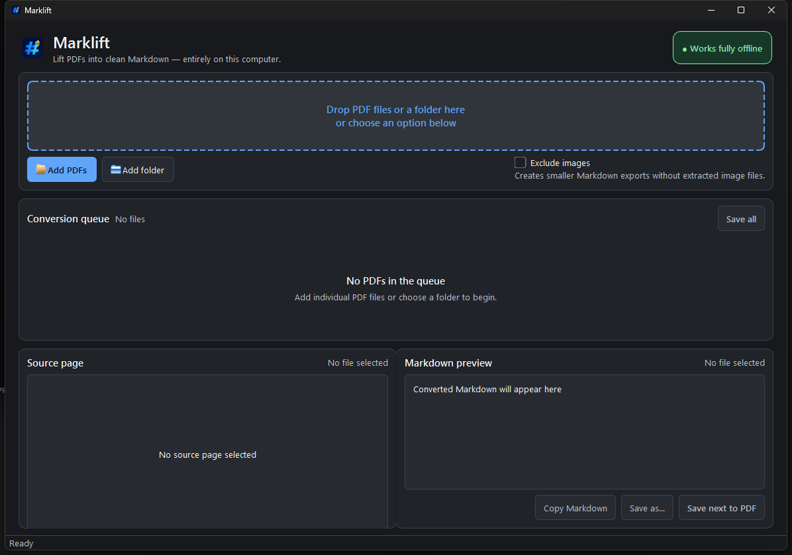

# Marklift

<p align="center">
  
</p>

**Turn local PDFs into clean Markdown — privately, predictably, and fully offline.**

> A focused Windows tool for people who need usable Markdown from important PDF
> documents without sending those documents to a third-party service.

Marklift is a Windows desktop application for converting text PDFs, tables,
embedded images, and scanned pages into editable Markdown. Your documents stay
on your computer: Marklift does not upload files, require an account, call a
cloud API, collect telemetry, or check for updates while it runs.

> **Status:** Version 1.0.1 — verified Windows release. Automated,
> packaged-application, and isolated installed-application E2E verification are
> complete. The binaries are currently unsigned, so Windows SmartScreen may
> display an additional warning.



*The desktop workflow keeps intake, queue status, source preview, and Markdown
preview in one window.*

## Download for Windows

For a non-technical user, use the **[Download Marklift for Windows](https://github.com/liquid11/marklift/releases/download/v1.0.1/Marklift-Setup-1.0.1.exe)** link.
Download the latest `.exe` installer, open it, and follow the setup instructions.
You do not need to install Python or Tesseract separately.

This is the current [Marklift v1.0.1 public release](https://github.com/liquid11/marklift/releases/tag/v1.0.1).
The [full Releases page](https://github.com/liquid11/marklift/releases) contains
previous and future versions. The
[1.0.1 release-verification evidence](docs/releases/v1.0.1.md) documents the
automated, packaged, installed, and cleanup checks. The source code is available
below for developers.

## At a glance

| | |
| --- | --- |
| **Platform** | Windows 10/11 x64 |
| **Processing** | Local and offline |
| **Input** | Single PDFs, multiple PDFs, or folders |
| **Output** | Markdown with optional extracted-image assets |
| **OCR** | Bundled English OCR for scanned pages |
| **Protection** | No silent overwrite; explicit conflict decisions |

## Why Marklift?

PDFs are easy to read but difficult to edit, search, version, and reuse.
Marklift gives you a local conversion workflow that preserves useful structure
while keeping sensitive documents offline.

### Built for practical document work

Marklift is designed for researchers, analysts, students, technical writers,
operations teams, and anyone who needs to move content from PDF into a format
that can be edited, searched, reviewed, and version-controlled.

## Highlights

- Convert one PDF, multiple PDFs, or every PDF in a folder.
- Drag and drop files or folders into the queue.
- Extract headings, paragraphs, lists, tables, and embedded images.
- Use bundled English OCR for scanned or image-only pages.
- Preview the source page and rendered Markdown before saving.
- Save beside the source PDF, choose another destination, or save a batch.
- Copy converted Markdown directly to the clipboard.
- Protect existing output with conflict checks and explicit replace/skip choices.
- Continue processing a batch when one input fails.
- Work without an internet connection, account, or server.

## The workflow

```text
Add PDFs  →  Convert locally  →  Review previews  →  Save or copy Markdown
```

The queue keeps each file's progress and result visible. A damaged file can be
reported without stopping the rest of a batch, and incomplete output is not
published after cancellation or a failed save.

## Quick start

1. Install Marklift from the Windows installer in the repository's Releases
   page.
2. Open Marklift and choose **Add PDFs**, **Add folder**, or drop PDFs into the
   intake area.
3. Leave **Exclude images** unchecked if you want extracted images and relative
   image links in the Markdown output.
4. Select a completed queue item to inspect the source and Markdown previews.
5. Choose **Save next to PDF**, **Save as…**, **Copy Markdown**, or **Save all**.

For the complete workflow, output layout, troubleshooting, and privacy notes,
see the [Marklift User Guide](docs/USER_GUIDE.md).

## Download and release status

When a public release is available, download the Windows installer from the
repository's GitHub Releases page. End users do not need Python, Tesseract, or any other
separate dependency; the installer bundles the application and English OCR
runtime.

The repository is organized so that the README answers “What is this and how
do I start?”, while the [User Guide](docs/USER_GUIDE.md) answers “How do I use
it safely and get the result I want?”.

The current packaging process produces:

```text
dist/installer/Marklift-Setup-1.0.1.exe
```

## System requirements

### End users

- Windows 10 or Windows 11, 64-bit
- No separate Python or Tesseract installation required for the packaged app
- Enough free disk space for the application and generated Markdown/image files

### Developers building from source

- Windows 10/11 x64 is the supported release target
- Python 3.11.x
- English 64-bit Tesseract for packaging
- Inno Setup 6 (`ISCC.exe`) for the installer

## Run from source

```powershell
py -3.11 -m venv .venv
.\.venv\Scripts\Activate.ps1
python -m pip install -e ".[dev]"
marklift
```

Run the default checks before making a change or preparing a release:

```powershell
ruff check .
pytest -q
```

The optional 100-page benchmark is run separately:

```powershell
pytest -q -m performance
```

## Build the Windows installer

```powershell
python src\packaging\build.py
ISCC.exe src\packaging\installer.iss
```

The build script creates a one-folder application under `dist\Marklift` and
the installer is written to `dist\installer`.

Before public distribution, verify the installed application—not only the
source checkout—and sign both `Marklift.exe` and the installer with a trusted
Authenticode certificate to reduce SmartScreen warnings.

## Output behavior

For a source file such as `report.pdf`, the normal output is:

```text
report.md
report_assets/       # created when embedded images are included
```

Image links are relative, so the Markdown and its assets can be moved together.
Marklift does not silently overwrite an existing Markdown file or asset folder.
Batch saves show one preflight summary and let you choose **Replace existing**,
**Skip existing**, or **Cancel**.

## Privacy and limitations

Conversion, previews, OCR, and output publication happen locally. Marklift has
no runtime uploads, accounts, telemetry, update checks, or network dependency.

OCR accuracy depends on scan quality, page layout, resolution, and language.
The bundled OCR runtime is English-only. Password-protected PDFs are not
converted, and a damaged or invalid PDF is reported without stopping the rest
of a batch.

Marklift is intentionally a focused desktop converter. It does not provide
cloud conversion, collaborative editing, a plugin system, or automatic
document synchronization.

## Documentation

- [Changelog](CHANGELOG.md) — release notes and notable fixes
- [1.0.1 Release Verification](docs/releases/v1.0.1.md) — automated, packaged
  application, and artifact-integrity evidence
- [User Guide](docs/USER_GUIDE.md) — installation, conversion workflows,
  output handling, troubleshooting, and privacy
- [Specification](docs/Marklift_Specification_Driven_Development.md) —
  implementation-aligned behavior and acceptance criteria
- [Contributing](CONTRIBUTING.md)
- [Security Policy](SECURITY.md)
- [Third-Party Licences](THIRD_PARTY_LICENSES.md)

## Project principles

- **Privacy by design:** local files stay local during conversion.
- **Safe publication:** existing output is protected unless replacement is
  explicitly chosen.
- **Transparent behavior:** OCR use, skipped images, and uncertain tables are
  surfaced as warnings.
- **Focused scope:** the product remains a dependable desktop converter rather
  than becoming a cloud platform or document-management suite.

## Licence

Marklift is licensed under the GNU Affero General Public License, version 3 or
any later version. See [LICENSE](LICENSE).

Marklift uses PyMuPDF and `pymupdf4llm`, which are available under AGPL terms.
Review the included dependency notices before creating a commercial
distribution. This project is not legal advice.
